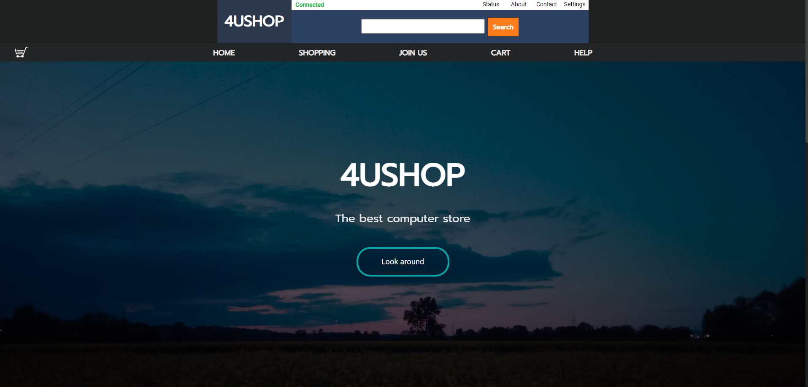
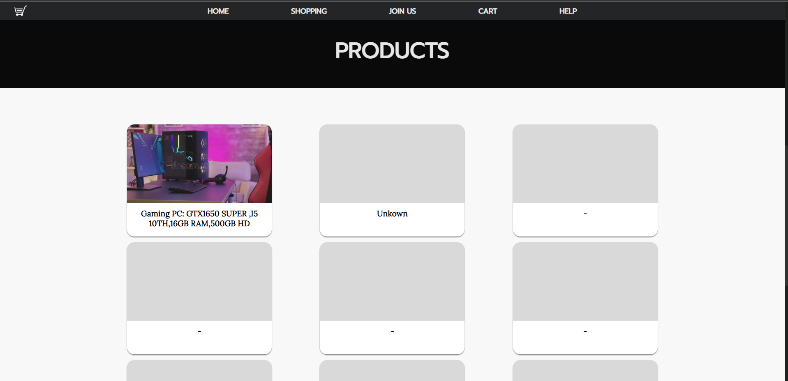
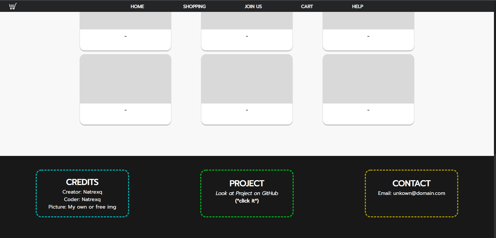

# Free online shop project - 4UShop by Natrexq
<h2>About project</h2>
<h4> - Languages who i used to make project:</h4>
<h4><i>- [ Javascript,Php ] -</i></h4>
 
<h4> - I will write more info soon ok?</h4>
 
<h4> - Screenshots: (not updated for a long time xD)

<b> - Update log: (Honestly you won't find intresting things here..</b>
 
  <h4><b>19/05/2022</b></h4>
<h5><i>- I started this project</i></h5>
  <h5><i>- maked the basic files like: css,simple js script</i></h5>
  
   
  <h4><b>22/05/2022</b></h4>
<h5><i>- Maked better styles of home page</i></h5>
  <h5><i>- I added one new function</i></h5>
   
  <h4><b>23/05/2022</b></h4>
<h5><i>- Change style of home site</i></h5>
  <h5><i> - writed new script in js</i></h5>
  <h5><i>- added functionaly gui</i></h5>
  <h5><i>- changed a lot of small issues</i></h5>
  <h5><i>???</i></h5>
  <h5><i>???</i></h5>
   
   <h4><b>24/05/2022</b></h4>
<h5><i>- Change style of home site</i></h5>
  <h5><i>- added crash website (When server cant display website )Error 404 comunicate</i></h5>
  <h5><i>- nothing</i></h5>
   
   <h4><b>28/05/2022</b></h4>
<h5><i>- Change style of home site</i></h5>
  <h5><i>- changed a lot of small issues</i></h5>
   <h5><i>- I tryed write simple slider</i></h5>
   
    
   <h4><b>29/05/2022</b></h4>
<h5><i>- I did big change of website style</i></h5>
   <h5><i>- fixed a lot bugs</i></h5>
   <h5><i>- edit scrool bar</i></h5>
  <h5><i>- started writing buy script</i></h5>
   <h5><i>- Updated screen shots of webiste in readme.md</i></h5>
  
   
  <h4><b>More in Update_log.txt (You won't find anything here)</b></h4>

